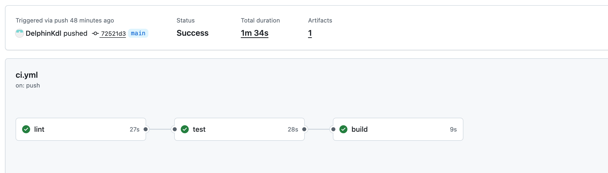

# Metro Transit Analytics Platform

[](https://github.com/DelphinKdl/metro-transit-etl-pipeline/actions/workflows/ci.yml)
[](https://www.python.org/downloads/)
[](https://airflow.apache.org/)
[](https://www.postgresql.org/)
[](https://docs.docker.com/compose/)
[](LICENSE)


An ETL pipeline that pulls real-time train predictions from the WMATA API every 5 minutes, cleans and validates the data through a Medallion Architecture (Bronze → Silver → Gold), and serves wait-time analytics through a Streamlit dashboard.

| Layer | Records | Detail |
|-------|---------|--------|
| Bronze · Raw | 1,081,460 | API responses ingested |
| Silver · Cleaned | 822,492 | 76.1% yield after quality filtering |
| Gold · Aggregated | 296,350 | Station-level wait-time metrics |

---

## What it does

The pipeline tracks wait times across 91 stations and 6 metro lines. It runs on a 5-minute cadence, applies 8 quality checks before anything reaches the Gold layer, and feeds a dashboard that breaks down performance by line, station, time of day, and day of week.

The questions it answers:
- Which lines have the highest wait times right now, and how does that compare to last week?
- Are wait times at a given station getting better or worse over time?
- What does the congestion pattern look like across the full week?

---

## Architecture


## Pipeline Flow

| Step | Task | Layer | What happens |
|------|------|-------|-------------|
| 1 | `extract_predictions` | Bronze | Fetch predictions from WMATA API with retry/backoff, store raw JSON |
| 2 | `transform_data` | Silver | Clean, filter invalid entries, standardize types, aggregate by station + line |
| 3 | `quality_check` | Gate | Run 8 automated validations. Pipeline stops if any check fails |
| 4 | `load_to_database` | Gold | Upsert aggregated metrics to `gold.station_wait_times` via `ON CONFLICT` |


Every record carries a `run_id` from extraction through Gold for full traceability.

---

## Dashboard

Available at http://localhost:8501 once the stack is running.

| Component | What it shows |
|-----------|--------------|
| Dynamic headline | "Silver Line averaging 10.3 min, 29% above system average" |
| KPI cards with deltas | Avg wait, best/worst lines, pipeline health vs. previous period |
| Line performance bar | All 6 lines with a system-average benchmark line |
| Current vs. Previous | Grouped bar comparing this period to the last |
| Wait time trends | Time-series with normal band shading and rush-hour markers |
| Day × Hour heatmap | 7×24 matrix showing when congestion peaks |
| Station drill-down | Top 10 longest and shortest waits with conditional coloring |
| Pipeline observability | Bronze/Silver/Gold record counts, recent run log |


---

## Data Quality

8 automated checks gate data before it reaches Gold:

| # | Check | What it validates | Threshold |
|---|-------|-------------------|-----------|
| 1 | Schema validation | All required columns present | Strict |
| 2 | Null rate (avg_wait) | Percentage of null values | ≤ 5% |
| 3 | Null rate (station_code) | Percentage of null values | ≤ 5% |
| 4 | Wait time range | Values within realistic bounds | 0-60 minutes |
| 5 | Valid stations | Known station codes (91) | ≤ 5 unknown |
| 6 | Valid lines | Only RD, BL, OR, SV, GR, YL | Strict |
| 7 | Data freshness | Records less than 10 minutes old | < 10% stale |
| 8 | Completeness | Minimum stations reporting | Time-aware: 3 (night) to 40 (peak) |

If any check fails, the pipeline stops. Bad data never reaches Gold.

---

## Data Model

### Fact Table: `gold.station_wait_times`

| Column | Type | Description |
|--------|------|-------------|
| station_code | VARCHAR | Station identifier |
| station_name | VARCHAR | Readable name |
| line | VARCHAR | Metro line (RD, BL, OR, SV, GR, YL) |
| avg_wait_minutes | FLOAT | Average wait time |
| min_wait_minutes | FLOAT | Minimum wait observed |
| max_wait_minutes | FLOAT | Maximum wait observed |
| train_count | INTEGER | Trains in prediction window |
| calculated_at | TIMESTAMP | When metrics were computed |
| run_id | VARCHAR | Pipeline execution ID (lineage) |

### Dimension Table: `gold.dim_stations`

| Column | Type | Description |
|--------|------|-------------|
| station_code | VARCHAR | Primary key |
| station_name | VARCHAR | Full station name |
| line_code | VARCHAR | Associated metro line |
| corridor | VARCHAR | Geographic corridor |
| lat / lng | FLOAT | Geographic coordinates |

---

## Tech Stack

| Layer | Technology | Purpose |
|-------|-----------|---------|
| Language | Python 3.11 | Pipeline and dashboard logic |
| Orchestration | Apache Airflow 2.x | DAG scheduling, retries, task dependencies |
| Database | PostgreSQL 15 | Medallion data warehouse (3 schemas) |
| Processing | pandas + NumPy | Transformation, aggregation, cleaning |
| API Client | requests + urllib3 | Retry with exponential backoff |
| Configuration | Pydantic v2 Settings | Validated env var loading |
| Dashboard | Streamlit + Plotly | Interactive analytics with 5-min auto-refresh |
| Containerization | Docker Compose | 6 services, one-command deployment |
| CI/CD | GitHub Actions | lint → test → build on every push |
| Linting | ruff + black + mypy | Style, formatting, type checking |
| Testing | pytest + pytest-cov | 57 unit tests + integration tests |
| Logging | structlog (JSON) | Structured observability |
| DB Admin | pgAdmin 4 | Visual database exploration |
| Data Source | [WMATA Real-Time API](https://developer.wmata.com/) | Live train predictions |

---

## Quick Start

### Prerequisites

- Docker & Docker Compose
- Python 3.11+ (for local development only)
- WMATA API Key - [get one free](https://developer.wmata.com/)

### Setup

```bash
git clone https://github.com/DelphinKdl/metro-transit-etl-pipeline.git
cd metro-transit-etl-pipeline

cp .env.example .env    # Add your WMATA_API_KEY and DB credentials
make init               # Initialize Airflow (first time only)
make up                 # Start all 6 services
make trigger            # Trigger first pipeline run
```

### Access Services

| Service | URL | Credentials |
|---------|-----|-------------|
| Airflow UI | http://localhost:8080 | `airflow` / `airflow` |
| Dashboard | http://localhost:8501 | - |
| pgAdmin | http://localhost:5050 | `admin@admin.com` / `admin` |
| PostgreSQL | `localhost:5432` | from `.env` |

### Set API Key in Airflow

1. Open http://localhost:8080 → Admin → Variables
2. Add: Key = `WMATA_API_KEY`, Value = your API key

---

## Project Structure

```
metro-transit-etl-pipeline/
├── src/
│   ├── clients/
│   │   └── wmata_client.py     # API client (retry, rate-limit, session pooling)
│   ├── core/
│   │   ├── transformer.py      # Data cleaning & aggregation
│   │   ├── quality_checks.py   # 8 automated validation checks
│   │   └── loader.py           # PostgreSQL upsert operations
│   ├── models/
│   │   └── predictions.py      # TrainPrediction dataclass
│   └── utils/
│       └── logger.py           # Structured JSON logging (structlog)
├── dags/
│   └── wmata_etl_dag.py        # Airflow DAG (TaskFlow API)
├── dashboard/
│   ├── app.py                  # Streamlit dashboard (Plotly)
│   └── requirements.txt
├── scripts/
│   ├── schema.sql              # Medallion schema DDL
│   └── seed-stations.sql       # dim_stations (91 stations)
├── docker/
│   ├── docker-compose.yml      # 6 services
│   ├── Dockerfile.airflow
│   └── Dockerfile.dashboard
├── tests/
│   ├── unit/                   # 57 unit tests
│   └── integration/
├── config/
│   └── settings.py             # Pydantic v2 validated settings
├── docs/
├── .github/workflows/ci.yml
├── .env.example
├── pyproject.toml
├── Makefile
└── LICENSE
```

---

## Testing & CI/CD

```bash
make test             # 57 unit tests
make test-cov         # With coverage report
make lint             # ruff + black + mypy
```

Every push to `main` triggers three jobs:

| Job | Tools | What It Checks |
|-----|-------|---------------|
| lint | ruff, black, mypy | Code style, formatting, type safety |
| test | pytest + coverage | 57 unit tests |
| build | hatchling | Package builds correctly |



---

## License

MIT - see [LICENSE](LICENSE).

Data sourced from the [WMATA Real-Time API](https://developer.wmata.com/), subject to their [Developer License Agreement](https://developer.wmata.com/license).
