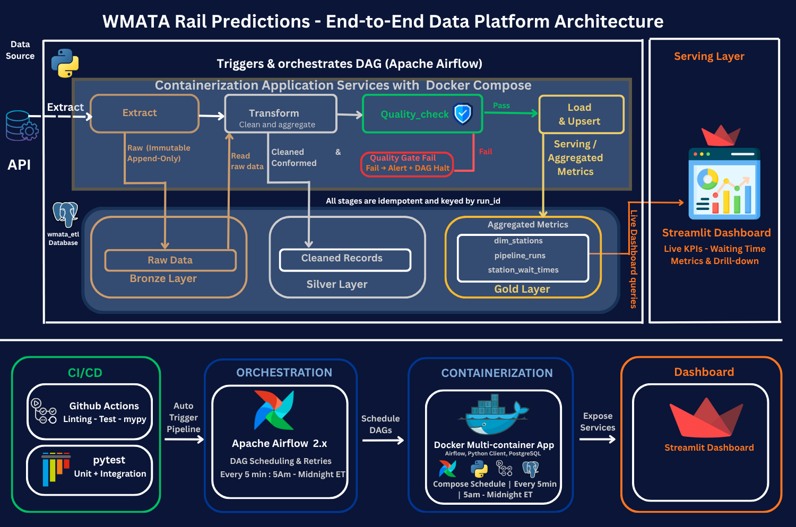
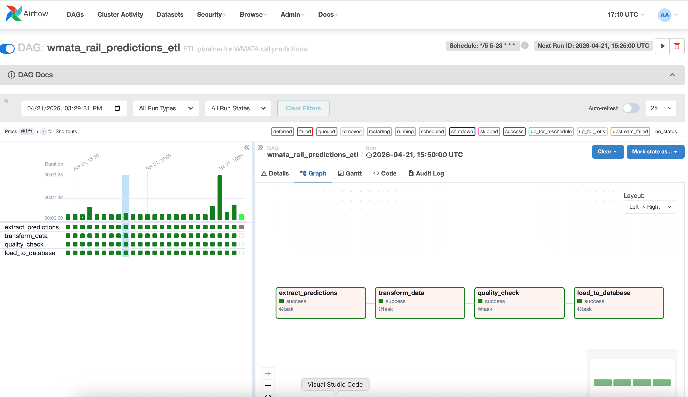
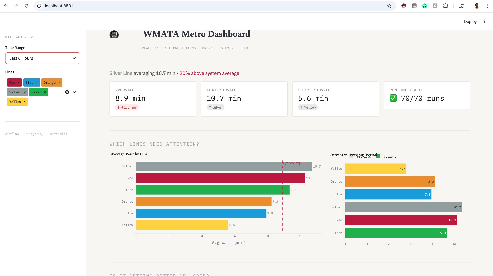
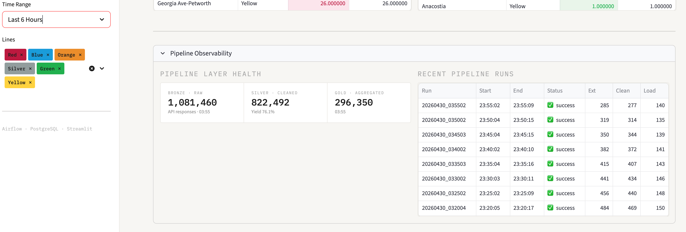

# Metro Transit Analytics Platform

**Real-Time ETL Pipeline + Operations Insights Dashboard**

A production-grade analytics platform that ingests real-time train arrival predictions from the Washington Metropolitan Area Transit Authority (WMATA), transforms them into actionable wait-time metrics, and delivers operational insights through a live dashboard.

Built using a **Medallion Architecture** (Bronze → Silver → Gold) and orchestrated with **Apache Airflow**, this system enables transit operators to monitor performance, identify congestion patterns, and make data-driven decisions.

### Pipeline at a Glance

| Layer | Records | Detail |
|-------|---------|--------|
| **Bronze** · Raw | 1,081,460 | API responses ingested |
| **Silver** · Cleaned | 822,492 | 76.1% yield after quality filtering |
| **Gold** · Aggregated | 296,350 | Analytics-ready station metrics |

---

## Business Problem

Public transit systems often lack real-time visibility into:

- **Passenger wait times** across stations and lines
- **Peak congestion periods** that strain capacity
- **Underperforming lines and stations** requiring intervention

This limits the ability of operations teams to optimize train frequency, reduce delays, and improve rider experience.

---

## Project Goal

Design and implement an end-to-end analytics system that:

- Tracks real-time wait times across 91 stations and 6 metro lines
- Identifies congestion patterns and operational inefficiencies
- Provides actionable insights through a live storytelling dashboard
- Enables data-driven operational decisions with quantified evidence

---

## Key KPIs

| KPI | Description |
|-----|-------------|
| **Average wait time** | Per station, per line, and system-wide |
| **Peak hour congestion** | Wait time spikes during AM/PM rush |
| **Line performance vs. system average** | Relative performance ranking |
| **Station-level delay patterns** | Persistent outliers identification |
| **Pipeline reliability** | Data freshness, completeness, and uptime |

---

## Business Questions Answered

1. What are the peak congestion hours across the system?
2. Which stations consistently experience the longest wait times?
3. Which metro lines are underperforming relative to the system average?
4. How do wait times vary by time of day and day of week?
5. Where should transit authorities prioritize improvements?

---

## Key Insights

- **Peak congestion** occurs during 8–9 AM and 5–6 PM across most lines
- Certain lines consistently perform **above system average** wait times
- A subset of stations shows **persistent delays** regardless of time
- Weekend patterns differ significantly, with more evenly distributed demand
- System performance varies by **both time-of-day and geographic location**

---

## Business Recommendations

| Priority | Recommendation | Expected Impact |
|----------|---------------|-----------------|
| High | Increase train frequency during peak hours (8–9 AM, 5–6 PM) | Reduce peak wait times by 20–30% |
| High | Investigate operational inefficiencies on high-delay lines | Improve line performance parity |
| Medium | Prioritize infrastructure improvements at congested stations | Reduce chronic delay patterns |
| Medium | Optimize scheduling during off-peak periods | Reduce operational costs |
| Ongoing | Use real-time monitoring to proactively manage delays | Enable rapid response to disruptions |

---

## End-to-End Architecture



---
## Pipeline Flow

| Step | Task | Layer | Description |
|------|------|-------|-------------|
| 1 | `extract_predictions` | Bronze | Fetch real-time predictions from WMATA API with retry/backoff, store raw JSON in `bronze.raw_predictions` |
| 2 | `transform_data` | Silver | Clean, filter invalid entries, standardize types, persist to `silver.cleaned_predictions`, aggregate by station + line |
| 3 | `quality_check` | Gate | Run 8 automated validations - **pipeline stops if any check fails** |
| 4 | `load_to_database` | Gold | Upsert aggregated wait-time metrics to `gold.station_wait_times` via `ON CONFLICT` (idempotent) |



**Lineage**: Every record carries a `run_id` from extraction through Gold, enabling full traceability.

---

## Dashboard Features



The Streamlit dashboard at **http://localhost:8501** provides:

| Component | Visualization | Purpose |
|-----------|--------------|---------|
| **Dynamic headline** | Context-aware narrative | "Red Line 42% above system average" |
| **KPI cards with deltas** | Metric cards with period comparison | Avg wait, best/worst lines, pipeline health |
| **Line performance** | Horizontal bar + system-avg benchmark | Compare all 6 lines at a glance |
| **Current vs. Previous** | Grouped bar chart | Trend direction per line |
| **Wait time trends** | Time-series + normal band + rush-hour shading | Spot anomalies and patterns |
| **Day × Hour heatmap** | Color matrix (7 days × 24 hours) | Weekly congestion patterns |
| **Station drill-down** | Top 10 longest/shortest waits | Conditional coloring for outliers |
| **Pipeline observability** | Layer health + run log | Bronze/Silver/Gold counts and status |



---

## Data Quality & Reliability

The pipeline includes **8 automated validation checks** that gate data before it reaches the Gold layer:

| # | Check | Validates | Threshold |
|---|-------|-----------|-----------|
| 1 | Schema validation | All required columns present | Strict |
| 2 | Null rate (avg_wait) | Percentage of null values | ≤ 5% |
| 3 | Null rate (station_code) | Percentage of null values | ≤ 5% |
| 4 | Wait time range | Values within realistic bounds | 0–60 minutes |
| 5 | Valid stations | Known WMATA station codes (91) | ≤ 5 unknown |
| 6 | Valid lines | Only RD, BL, OR, SV, GR, YL | Strict |
| 7 | Data freshness | Records less than 10 minutes old | < 10% stale |
| 8 | Completeness | Minimum stations reporting | Time-aware: 3 (night) – 40 (peak) |

**If any check fails → pipeline stops → bad data never reaches Gold.**

---

## Data Model

### Medallion Architecture (Bronze → Silver → Gold)

### Fact Table: `gold.station_wait_times`

| Column | Type | Description |
|--------|------|-------------|
| station_code | VARCHAR | WMATA station identifier |
| station_name | VARCHAR | Human-readable name |
| line | VARCHAR | Metro line (RD, BL, OR, SV, GR, YL) |
| avg_wait_minutes | FLOAT | Average wait time |
| min_wait_minutes | FLOAT | Minimum wait observed |
| max_wait_minutes | FLOAT | Maximum wait observed |
| train_count | INTEGER | Trains in prediction window |
| calculated_at | TIMESTAMP | When metrics were computed |
| run_id | VARCHAR | Pipeline execution ID (lineage) |

### Dimension Table: `gold.dim_stations`

| Column | Type | Description |
|--------|------|-------------|
| station_code | VARCHAR | Primary key |
| station_name | VARCHAR | Full station name |
| line_code | VARCHAR | Associated metro line |
| corridor | VARCHAR | Geographic corridor |
| lat / lng | FLOAT | Geographic coordinates |

---

## Tech Stack

| Layer | Technology | Purpose |
|-------|-----------|---------|
| **Language** | Python 3.11 | Core pipeline and dashboard logic |
| **Orchestration** | Apache Airflow 2.x | DAG scheduling, task dependencies, retries |
| **Database** | PostgreSQL 15 | Data warehouse (Bronze/Silver/Gold schemas) |
| **Data Processing** | pandas + NumPy | Transformation, aggregation, cleaning |
| **API Client** | requests + urllib3 | Retry with exponential backoff, rate limiting |
| **Configuration** | Pydantic v2 Settings | Validated env var loading with type safety |
| **Dashboard** | Streamlit + Plotly | Interactive analytics with live refresh |
| **Containerization** | Docker Compose (6 services) | One-command deployment |
| **CI/CD** | GitHub Actions | Automated lint → test → build pipeline |
| **Linting** | ruff + black + mypy | Code quality, formatting, type checking |
| **Testing** | pytest + pytest-cov | Unit tests (57) + integration tests |
| **Logging** | structlog (JSON) | Structured, context-rich observability |
| **DB Admin** | pgAdmin 4 | Visual database exploration |
| **Data Source** | [WMATA Real-Time API](https://developer.wmata.com/) | Live train predictions |

---

## Quick Start

### Prerequisites

- **Docker & Docker Compose** (required)
- **Python 3.11+** (for local development only)
- **WMATA API Key** - [Get one free](https://developer.wmata.com/)

### Setup

```bash
git clone https://github.com/DelphinKdl/metro-transit-etl-pipeline.git
cd metro-transit-etl-pipeline

cp .env.example .env    # Edit with your WMATA_API_KEY and DB credentials
make init               # Initialize Airflow (first time only)
make up                 # Start all 6 services
make trigger            # Trigger first pipeline run
```

### Access Services

| Service | URL | Credentials |
|---------|-----|-------------|
| **Airflow UI** | http://localhost:8080 | `airflow` / `airflow` |
| **Dashboard** | http://localhost:8501 | - |
| **pgAdmin** | http://localhost:5050 | `admin@admin.com` / `admin` |
| **PostgreSQL** | `localhost:5432` | from `.env` |

### Set API Key in Airflow

1. Open **http://localhost:8080** → **Admin → Variables**
2. Add: Key = `WMATA_API_KEY`, Value = your API key

---

## Project Structure

```
metro-transit-etl-pipeline/
├── src/                        # Core business logic
│   ├── clients/
│   │   └── wmata_client.py     # API client (retry, rate-limit, session pooling)
│   ├── core/
│   │   ├── transformer.py      # Data cleaning & aggregation
│   │   ├── quality_checks.py   # 8 automated validation checks
│   │   └── loader.py           # PostgreSQL upsert operations
│   ├── models/
│   │   └── predictions.py      # TrainPrediction dataclass
│   └── utils/
│       └── logger.py           # Structured JSON logging (structlog)
├── dags/
│   └── wmata_etl_dag.py        # Airflow DAG (TaskFlow API)
├── dashboard/
│   ├── app.py                  # Streamlit dashboard (Plotly visualizations)
│   └── requirements.txt
├── scripts/
│   ├── schema.sql              # Medallion schema DDL
│   └── seed-stations.sql       # dim_stations (91 WMATA stations)
├── docker/
│   ├── docker-compose.yml      # 6 services: Airflow + PG + Dashboard + pgAdmin
│   ├── Dockerfile.airflow
│   └── Dockerfile.dashboard
├── tests/
│   ├── unit/                   # 57 unit tests
│   └── integration/            # End-to-end pipeline tests
├── config/
│   └── settings.py             # Pydantic v2 validated settings
├── docs/                       # 12 documentation files
├── .github/workflows/ci.yml    # GitHub Actions (lint → test → build)
├── .env.example                # Environment variable template
├── pyproject.toml              # Dependencies & tool config (hatchling)
├── Makefile                    # All dev & deployment commands
└── LICENSE                     # MIT
```

---

## Testing & CI/CD

### Automated Testing

```bash
make test             # 57 unit tests
make test-cov         # With coverage report
make lint             # ruff + black + mypy
```

### GitHub Actions Pipeline

Every push to `main` triggers three sequential jobs:

| Job | Tools | What It Checks |
|-----|-------|---------------|
| **lint** | ruff, black, mypy | Code style, formatting, type safety |
| **test** | pytest + coverage | 57 unit tests, coverage report to Codecov |
| **build** | hatchling | Package builds correctly |

---

## What This Project Demonstrates

- **End-to-end analytics thinking** Data → Insights → Decisions
- **Production data engineering**  Idempotent loads, quality gates, observability
- **Strong SQL + data modeling** Medallion architecture, dimensional design
- **Real-time pipeline design** 5-minute cadence, circuit breaker, retry logic
- **Data quality as a first-class concern** 8 automated checks, pipeline halts on failure
- **Dashboard-driven storytelling**  Narrative headlines, contextual KPIs, drill-downs
- **DevOps maturity** Docker, CI/CD, structured logging, automated testing
- **Business-focused problem solving** KPIs, recommendations, measurable impact

---

## License

MIT License. See [LICENSE](LICENSE) for details.

---

## WMATA API

Usage of the WMATA API is subject to the [WMATA Developer License Agreement](https://developer.wmata.com/license).
